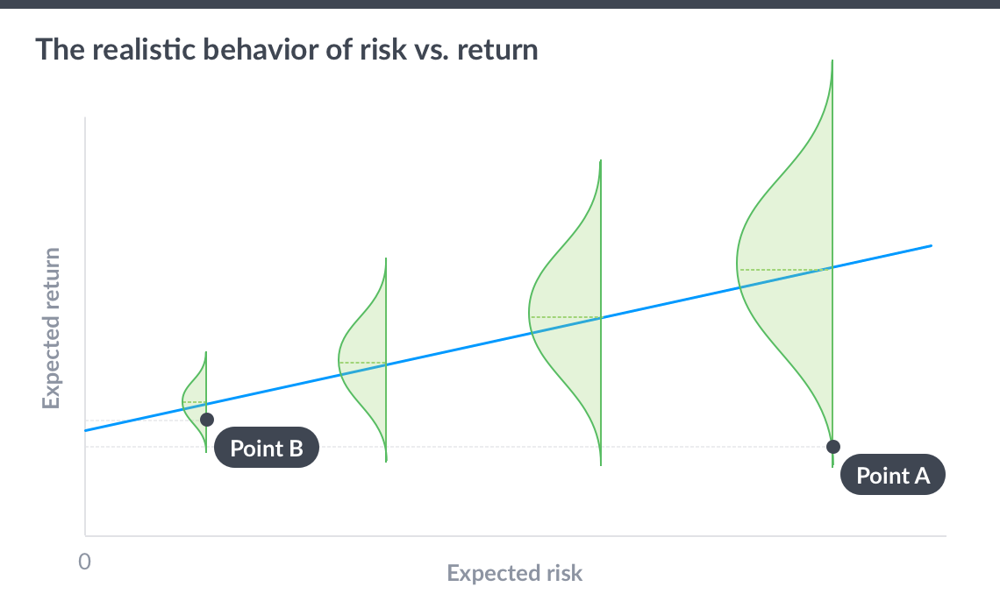

```{r setup, include=FALSE}
knitr::opts_chunk$set(echo = F, warning = F, message = F)
library(ggplot2)
library("ggthemes")
library(scales)
library(plyr)
library(dplyr)
library(magrittr)
library(reshape2)
source("distribution_plots_of_returns.R")

# Key parameters used below
risk_levels <- c(0.1, 0.5, 0.8)
ptiles <- c(0.2, 0.5, 0.8)
focus_year <- 7
```

## Trying to portray risk and return
Andy Rachleffs recently wrote a [post](http://seekingalpha.com/article/4056039-risk-simple-appears?page=2) about how the standard efficient frontier graph of risk and return can mislead investors. While we generally know what the mean return is, but 'risk' is far harder to understand, they can have the perception that the highest risk & return portfolio is best. 

To try to make it more 'realistic', he included the distribution of potential outcomes vertically, which is a nice touch. 

But... it was still misleading! Notice how it _still_ looks like the higest risk portfolio was best: the potential downside of each portfolio is the same, but the high risk portfolio has substantially more upside! 

```{r, out.width = "600px", fig.align='center'}

```


Of course, that's *_not_* an accurate portrayal of risk and return.  The fact is that, *_in the short run_* the risk dominates the potential outcomes of the portfolio, no the means. 
The graph below is more realistic about the relationship between expected risk and return over a one year investment horizon. The dot represents the mean expected return. Notice how they all seem like they're at about the same place, compared to the difference in ranges? 

```{r}
ps <- portstats(0.20)
low_risk <- rnorm(n = 10000, mean = ps['er'], sd = ps['sd']) / 100
ps <- portstats(0.5)
medium_risk <- rnorm(n = 10000, mean = ps['er'], sd = ps['sd']) / 100
ps <- portstats(0.9)
high_risk <- rnorm(n = 10000, mean = ps['er'], sd = ps['sd']) / 100


datums <- data.frame(low_risk = low_risk, 
                     medium_risk = medium_risk, 
                     high_risk = high_risk)

means <- as.data.frame(apply(datums, 2, mean))
means$variable <- row.names(means)
names(means) <- c("value", "variable")
```


```{r}
datums_long <- melt(datums)

pdat <- datums_long %>%
  group_by(variable) %>%
  do(data.frame(loc = density(.$value)$x,
                dens = density(.$value)$y))

pdat$dens <- ifelse(pdat$variable == 'medium_risk', pdat$dens + 15, pdat$dens)
pdat$dens <- ifelse(pdat$variable == 'high_risk', pdat$dens + (15*2), pdat$dens)

means$loc <- c(0, 15, 30)

ggplot(pdat, aes(dens, loc, group = interaction(variable))) + 
  geom_polygon(fill= adjustcolor("dark green", alpha.f = 0.2), color="dark green") +
  scale_x_continuous(breaks = c(0, 15, 30), labels = c('Low \n(20% stocks)', 'Medium \n(50% stocks)',"High \n(90% stocks)")) +
  scale_y_continuous(breaks = pretty(pdat$loc), label=percent) + 
  ylab('Expected Return') + xlab("Expected Risk") + 
  geom_hline(yintercept = 0, color = "dark grey") +
  geom_point(data = means, aes(x = loc, y = value), size=2, color="orange") +
  theme_minimal() + theme(axis.text.y = element_text(colour = "dark grey")) + 
  coord_cartesian(ylim = c(-0.4, 0.4)) 


```

I think this depiction of risk and return is far more realistic, revealing how much more potential for downside there is in higher risk portfolios. 

## But, add time, and things get better..
However.... these are expected returns over just a one year horizon. What if we take those same risk-return characteristic, and invested over 10 years? How might time change these outcomes? 

Let's start with the 50% stock portfolio, and look at the _cumulative_ return distribution at each year from 1 to 10. We can see that as we invest for longer and longer, the mass of probability '_smears_' upwards. The dots on each graph correspond to the 20th, 50th, and 80ths percentile outcomes in each case. Note how initially the bad outcomes involve losses, but over time even the worse cases gets better, even positive? 

Over time the _median_ dominates the _risk_ of the portfolio in determining if you'll experience gains or losses. 

```{r}

medium_risk_results <- cumulative_results(0.5, ptiles = ptiles)
medium_risk_densities <- medium_risk_results$cumul_densities

medium_risk_df <- data.frame(loc=NA, dens=NA, year=NA)
for(obj in 1:length(medium_risk_densities)) {
  temp <- medium_risk_densities[[obj]]
  head(temp)
  temp$year <- obj
  medium_risk_df <- rbind(medium_risk_df, temp)
}
medium_risk_final_results_clean <- medium_risk_df[!is.na(medium_risk_df$year),]

xfactor <- 5
medium_risk_final_results_clean$dens_adj <- medium_risk_final_results_clean$dens + (xfactor * medium_risk_final_results_clean$year)

cumul_quantiles_df <- data.frame(t(medium_risk_results$cumul_quantiles))
ptile_names <- c("lower", "median", "higher")
names(cumul_quantiles_df) <- ptile_names
cumul_quantiles_df$year <- seq(1:10)
cumul_quantiles_df_long <- melt(cumul_quantiles_df, measure.vars = ptile_names)
cumul_quantiles_df_long$year_adj <- cumul_quantiles_df_long$year * xfactor
```

```{r}
ggplot(medium_risk_final_results_clean, aes(dens_adj, loc, group=year)) + 
  geom_polygon(fill= adjustcolor("dark green", alpha.f = 0.2), color="dark green") +
  scale_x_continuous(breaks = unique(medium_risk_final_results_clean$year)*xfactor, labels = unique(medium_risk_final_results_clean$year)) + 
  scale_y_continuous(breaks = seq(-0.4, 1.2, 0.2), label=percent) +
  ylab('Expected Return') + xlab("Years invested") + 
  geom_point(data = cumul_quantiles_df_long, aes(year_adj, value, group=variable), color="orange") +
  geom_hline(yintercept = 0, color = "dark grey") +
  theme_minimal() + theme(axis.text.y = element_text(colour = "grey")) + 
  coord_cartesian(ylim = c(-0.4, 1.2)) 
```

### "Cumulative risk" depends "time"
The graph below shows the _cumulative_ expected returns distribution for three different stock level portfolios over a `r focus_year` investment horizon. You can see that the low stock portfolio doesn't have a huge range of outcomes, but the higher stock portfolio does. 

However, the below average percentile outcome in the high-stock portfolio (the lowest orange dot) is only a little bit worse than in the low-stock portfolio. But the median and upper-percentile outcomes are substantially higher. 

```{r}
# Let's compare results of the different portfolios, specifically at the 10 year horizon. 
low_risk_results  <- cumulative_results(0.2, ptiles = ptiles)
high_risk_results <- cumulative_results(0.9, ptiles = ptiles)

getYearResults <- function(results, year){
  list(cumul_densities = results$cumul_densities[year][[1]], 
      cumul_quantiles = results$cumul_quantiles[,year])
}


low_df <- getYearResults(low_risk_results,focus_year)$cumul_densities
low_df$risk <- 0.2

med_df <- getYearResults(medium_risk_results,focus_year)$cumul_densities
med_df$risk <- 0.5

high_df<- getYearResults(high_risk_results,focus_year)$cumul_densities
high_df$risk <- 0.9

all_df <- rbind(low_df, med_df, high_df)

xfactor <- 5
all_df$adj <- sapply(all_df$risk, function(x){
                              switch(as.character(x), 
                                   "0.2" = 0, 
                                   "0.5" = xfactor,
                                   "0.9" = xfactor * 2)
})
                     
all_df$dens_adj <- all_df$dens + all_df$adj

cumul_quantiles_df <- data.frame()
for(obj in c("low_risk_results", "medium_risk_results", "high_risk_results")){
   temp <- as.data.frame(t(getYearResults(get(obj), focus_year)$cumul_quantiles))
   names(temp) <- paste0("p",ptiles)
   temp$risk <- obj
   cumul_quantiles_df <- rbind(cumul_quantiles_df,temp)
}

ptile_names <- c("lower", "median", "higher")
cumul_quantiles_df$risk <- c(0.2, 0.5, 0.9)
cumul_quantiles_df$adj <- sapply(cumul_quantiles_df$risk, function(x){
                              switch(as.character(x), 
                                   "0.2" = 0, 
                                   "0.5" = xfactor,
                                   "0.9" = xfactor * 2)
})

cumul_quantiles_df_long <- melt(cumul_quantiles_df, measure.vars = 1:3)
#cumul_quantiles_df_long$risk_adj <- cumul_quantiles_df_long$risk +
```

```{r}
ggplot(all_df, aes(dens_adj, loc, group=risk)) + 
  geom_polygon(fill= adjustcolor("dark green", alpha.f = 0.2), color="dark green") +
  scale_x_continuous(breaks = unique(all_df$adj), labels = percent(unique(all_df$risk))) + 
  scale_y_continuous(breaks = seq(-0.4, 1.2, 0.2), label=percent) +
  ylab('Expected Cumulative Return') + xlab("Risk Level") + ggtitle(paste0("Expected final return distributions\nover a ", focus_year, " holding period for different risk levels")) + 
  geom_point(data = cumul_quantiles_df_long, aes(adj, value, group=variable), color="orange") +
  geom_hline(yintercept = 0, color = "dark grey") +
  theme_minimal() + theme(axis.text.y = element_text(colour = "grey")) + 
  coord_cartesian(ylim = c(-0.4, 1.2)) 
```

It's only when we invest over longer periods of time that we begin to see higher risk investments dominate lower ones. 