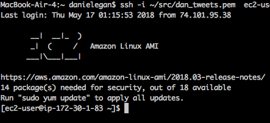

# Bottom Line
A guide for setting up a scheduled tweet-bot library on AWS EC2, and posting using R and cron jobs. 

Tools used:  
- AWS EC2: for a constantly on computer running the schedule   
- iTerm3: for ssh'ing into your EC2 instance.  
- git/github: for maintaining your code and library.   
- R: for accessing the library and interfacing with Twitter.   


# Background
I generally try to write ever-green/non-ephemeral articles. I've also noticed that other writers who try to do this will periodically share older content, which is great. I wanted to be able to do the same. 
 
So, I used to pay something like $500 a year for [MeetEdgar](www.meetedgar.com). It maintained a categorical library of social media content, and posts random things at pre-apppointed times from different categories. 

Rather than pay for it, I decided to built it myself. 


# Step 1: Setting up EC2
The first step is setting up an EC2 instance on AWS. If you're not familiar with EC2, here is a good [tutorial](https://www.datacamp.com/community/tutorials/aws-ec2-beginner-tutorial) of what it is and does. 

## Launching an instance
I used a Linux AMI because I'm used to Mac's command line interface, so the guide below is for the Linux models. 

You'll definitely want to launch a free teir instance: we're not doing heavy computing here, and it's free! 

Make sure you save down your keys somewhere you can find them. You'll need them shortly.

## Setting up the instance
First, you'll need to install R on the instance, and it's nice to get the updated version. 

I use [iterm3](https://www.iterm2.com/) as my command-line-interface (CLI), so the screenshots will be from there.

### Logging into your EC2 instance
You'll need to ssh into your EC2 instance. For me, this is a command like this

```bash
ssh -i ~/src/dan_tweets.pem  ec2-user@##.##.##.###
```

the `ssh -i` is the command, the first argument `~/src/dan_tweets.pem` is where your EC2 pem key is located on your computer, and the final argument `ec2-user@##.##.##.###` is the login name and web address of your EC2 instance. 

You know you'll be successfully logged in because you'll see a screen like this one:  



### Install R

This installs R onto the EC2 instance
```bash
sudo yum -y install R
```

In order to use internet functions like `install.packages()` in `R`, you'll want to update the EC2 instances web libraries. 

I followed the instructions from [here](https://stackoverflow.com/questions/20923209/problems-installing-the-devtools-package) and got it working. I just needed to:

```bash
sudo yum -y install libcurl libcurl-devel
sudo yum -y install openssl-devel
chmod 7503
```
Then I could use `R` packages like [devtools](https://github.com/r-lib/devtools). 

# Step 2: Get and save your twitter API credentials
In order to post scheduled tweets, you need to set up Twitter to allow an API connections. You can read how to do that here. 

Critically, you'll want to store them down securely, and never store or transmit them in plain-text or over an insecure connection. 

I recommend saving down a `twitter_credentials.yaml` file with your authentication credentials in this format. If you're not familiar with yaml, just know that the indentation is key. The example below holds credentials for two twitter accounts and one github account just in case it wasn't clear. 

```yaml
twitter:
  account: daniel_egan
    username: "dpegan_tweets"
    consumer_key: "##################"
    consumer_secret: "##################"
    access_token: "##################"
  account: some_other_account
    username: "someone_else_tweets"
    consumer_key: "##################"
    consumer_secret: "##################"
    access_token: "##################"

github:
  username: "bestdan"
  token: "###################"
```

# Step 3: The `R` code
Yes, I know you can do this with Python, Ruby or whatever. I know R best and this was the quickest way to get it up and running. Don't hate. 

### Aside: git/github/version control

The way I actually did this was to do all the `R` coding on my local computer, and then put it on github in the `myscellany` repo you're looking at now. 

Then, when ssh'd into the EC2 instance, I used git/github to pull down `myscellany`. 

Local R --> Github --> EC2 instance


## Making a library of cotent
So, we need to create a library of content! 

I'm going to use an file called `tweet_db.rda` to store my library of tweets. In R, I'll build this library using [build_twitter_db.R](build_twitter_db.R). Here's a snippet:

What's happening here is that the function [addNewTweetToDB](addNewTweetToDB.R) is just filling in a table with the content and saving it down to a file. 

We'll use that `tweet_db.rda` file on EC2 as the thing we're pulling content from to tweet. 


# Step 4: Scheduling: setting up cron jobs

## Scheduling tweets

- I had some issues editing the cron file, or more specifically _having my edits save_. You need to do this weird thing. 

```bash
export EDITOR=nano
sudo nano crontab -e
```

I can then edit the crontab file:

```crontab
05 12 * * 1 sudo sh src/myscellany/degan_tweets/postRandomTweet.sh
05 12 * * 3 sudo sh src/myscellany/degan_tweets/postRandomTweet.sh
05 12 * * 5 sudo sh src/myscellany/degan_tweets/postRandomTweet.sh
```

## Scheduling updates of the library
How do you get new content into the EC2 instance? In this case I set up a cron job which pulls 

# Step 5: Troubleshooting

```bash
#!/bin/bash
{
    sudo Rscript src/myscellany/degan_tweets/postRandomTweet_script.R
} >> src/myscellany/degan_tweets/log/bash_log.txt
```